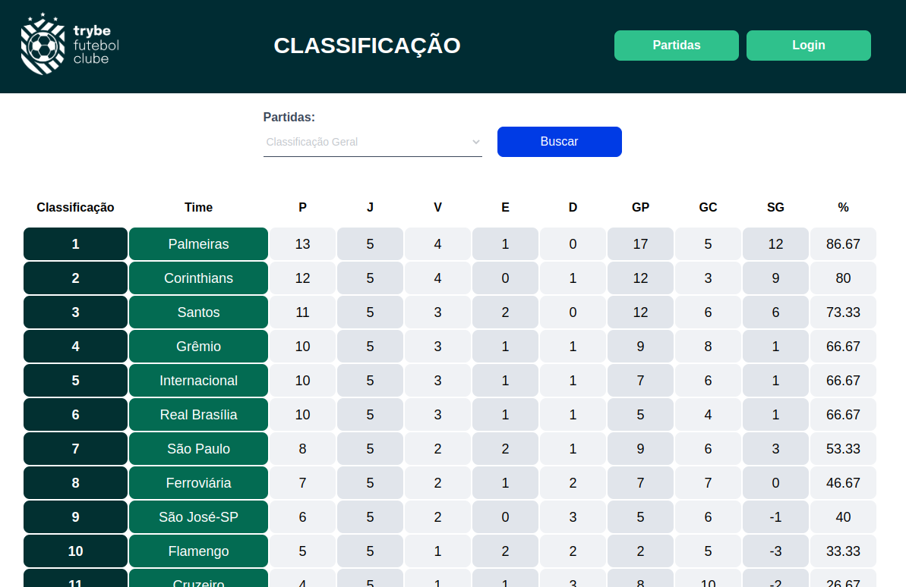

# TFC - Gerenciamento de classificação de um campeonato. (backend)
### `POO | Typescript | MongoDB | Mongoose | Mocha | Chai | Sinon | Docker | Express | Joi | JWT | BCript`
 
O TFC é um sistema de gerenciamento de campeonado onde é possível adicionar novos jogos, finalizar e alterar placares de partidas em andamento, e ver as classificações por visitantes, times da casa ou geral. Tudo feito a partir de informações básicas da partida.
 
 
 

 ## Objetivos:
<section>
- Praticar os conhecimentos adquiridos sobre Hofs
  - Praticar testes unitários com Jest

</section>

 

## Requisitos alcançados:

 1  - Desenvolva em `/app/backend/src/database` nas pastas correspondentes, uma migration e um model para a tabela de times
 2  - Desenvolva testes que cubram no mínimo 5 por cento dos arquivos em `/app/backend/src`, com um mínimo de 7 linhas cobertas
 3  - Desenvolva o endpoint `/teams` no back-end de forma que ele possa retornar todos os times corretamente
 4  - Desenvolva testes que cubram no mínimo 10 por cento dos arquivos em `/app/backend/src`, com um mínimo de 19 linhas cobertas
 5  - Desenvolva o endpoint `/teams/:id` no back-end de forma que ele possa retornar dados de um time específico
 6  - Desenvolva em `/app/backend/src/database` nas pastas correspondentes, uma migration e um model para a tabela de pessoas usuárias
 7  - Desenvolva testes que cubram no mínimo 15 por cento dos arquivos em `/app/backend/src`, com um mínimo de 25 linhas cobertas
 8  - Desenvolva o endpoint `/login` no back-end de maneira que ele permita o acesso com dados válidos no front-end
 9  - Desenvolva testes que cubram no mínimo 20 por cento dos arquivos em `/app/backend/src`, com um mínimo de 35 linhas cobertas
 10  - Desenvolva o endpoint `/login` no back-end de maneira que ele não permita o acesso com um email não cadastrado ou senha incorreta no front-end
 11  - Desenvolva testes que cubram no mínimo 30 por cento dos arquivos em `/app/backend/src`, com um mínimo de 45 linhas cobertas
 12  - Desenvolva um middleware de validação para o `token`, verificando se ele é válido, e desenvolva o endpoint `/login/role` no back-end de maneira que ele retorne os dados corretamente no front-end
 13  - Desenvolva em `/app/backend/src/database` nas pastas correspondentes, uma migration e um model para a tabela de partidas
 15  - Desenvolva o endpoint `/matches` de forma que os dados apareçam corretamente na tela de partidas no front-end
 16  - Desenvolva o endpoint `/matches` de forma que seja possível filtrar somente as partidas em andamento, e também filtrar somente as partidas finalizadas, na tela de partidas do front-end
 17  - Desenvolva o endpoint `/matches/:id/finish` de modo que seja possível finalizar uma partida no banco de dados
 18  - Desenvolva o endpoint `/matches/:id` de forma que seja possível atualizar partidas em andamento
 20  - Desenvolva o endpoint `/matches` de modo que seja possível cadastrar uma nova partida em andamento no banco de dados
 21  - Desenvolva o endpoint `/matches` de forma que não seja possível inserir uma partida com times iguais nem com um time que não existe na tabela de times
 23  - Desenvolva o endpoint `/leaderboard/home` de forma que retorne as informações do desempenho dos times da casa com as seguintes propriedades: `name`, `totalPoints`, `totalGames`, `totalVictories`, `totalDraws`, `totalLosses`, `goalsFavor` e `goalsOwn`
 24  - Desenvolva o endpoint `/leaderboard/home` de forma que seja possível filtrar as classificações dos times da casa na tela de classificação do front-end com os dados iniciais do banco de dados, incluindo as propriedades `goalsBalance` e `efficiency`, além das propriedades do requisito anterior
 25  - Desenvolva o endpoint `/leaderboard/home` de forma que seja possível filtrar as classificações dos times da casa na tela de classificação do front-end, e atualizar a tabela ao inserir a partida Corinthians 2 X 1 Internacional
 26  - Desenvolva o endpoint `/leaderboard/away` de forma que retorne as informações do desempenho dos times visitantes com as seguintes propriedades: `name`, `totalPoints`, `totalGames`, `totalVictories`, `totalDraws`, `totalLosses`, `goalsFavor` e `goalsOwn`
 27  - Desenvolva o endpoint `/leaderboard/away`, de forma que seja possível filtrar as classificações dos times quando visitantes na tela de classificação do front-end, com os dados iniciais do banco de dados, incluindo as propriedades `goalsBalance` e `efficiency`, além das propriedades do requisito anterior
 28  - Desenvolva o endpoint `/leaderboard/away` de forma que seja possível filtrar a classificações dos times quando visitantes na tela de classificação do frontend e ao inserir a partida Corinthians 2 X 1 Internacional a tabela será atualizada
 29  - Desenvolva o endpoint `/leaderboard` de forma que seja possível filtrar a classificação geral dos times na tela de classificação do front-end com os dados iniciais do banco de dados
(Bônus) 30 - Desenvolva o endpoint `/leaderboard` de forma que seja possível filtrar a classificação geral dos times na tela de classificação do front-end e atualizar a tabela ao inserir a partida Flamengo 3 X 0 Napoli-SC

## Créditos:

- Desenvolvido por mim: Endpoints, regras de negócio, queryes e configurações do docker, conforme solicitado nos requisitos acima.

- Desenvolvido pela `Trybe`: Todo o front-end e configurações do package.json e ts.config.
